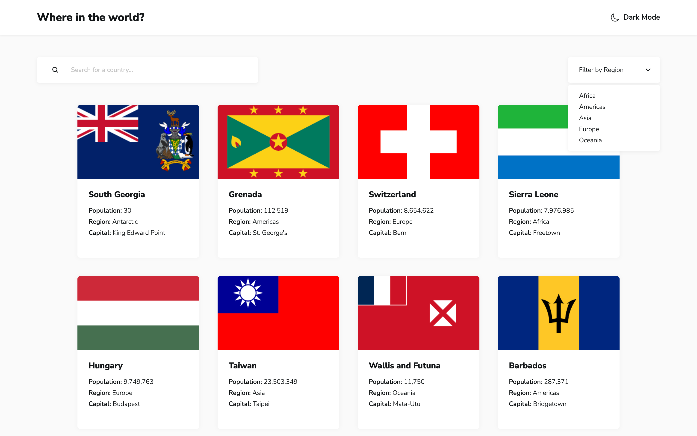
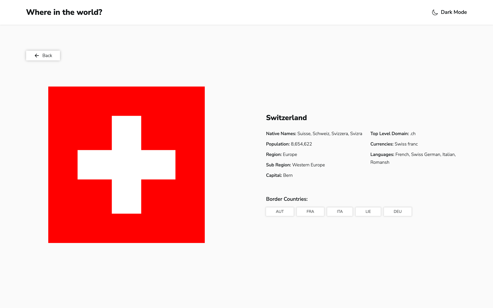

# Where in the world?





Where in the world? is a responsive web application built with **TypeScript**, **React**, **React Router** and **Webpack** that integrates with the [REST Countries API](https://www.frontendmentor.io/) to display detailed information about countries around the world.

The app allows users to view a list of all countries on the homepage, search for specific countries by name, and filter them by region. Clicking on a country provides more detailed information, including links to neighboring countries. The interface is fully responsive, adapting to different screen sizes, and features a light/dark mode toggle for a personalized experience.

## How to run the project locally

```
npm install
npm run start
```

---

A big thank you to [Frontend Mentor](https://www.frontendmentor.io/) for providing the design and challenge for this project.
